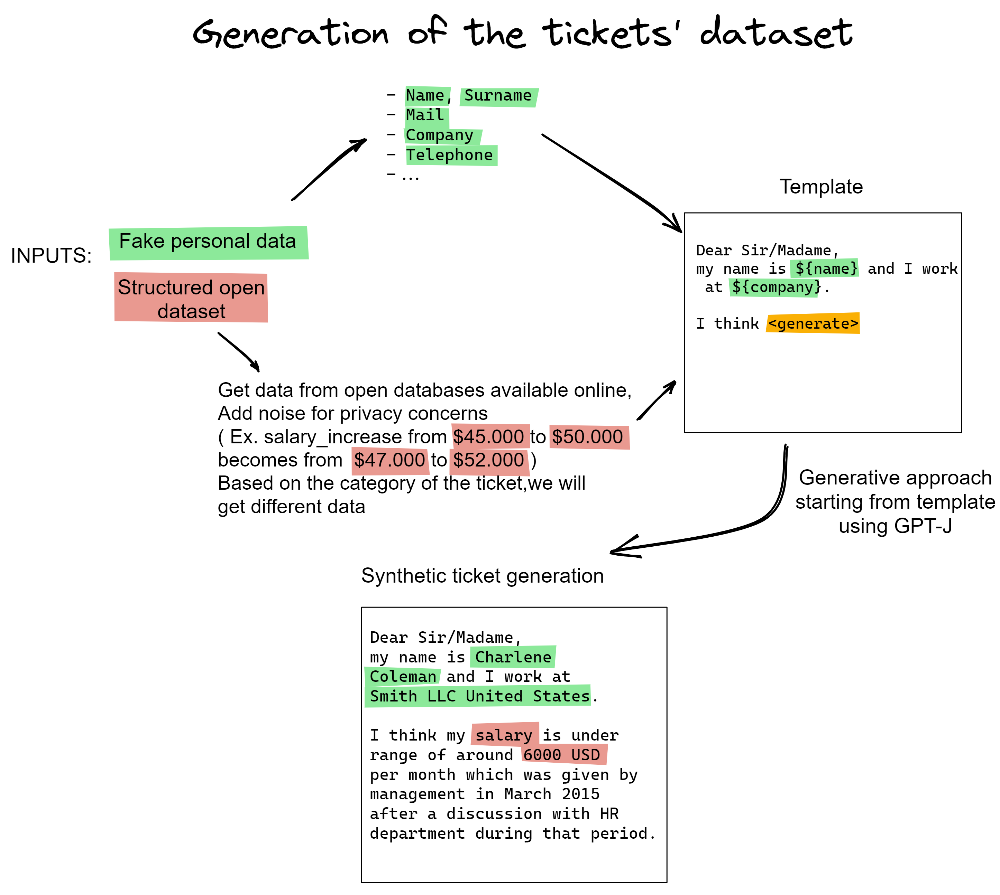

# HR request data set

The objective of this project is to generate synthetic tickets sent from employees to the HR department. The goal is not to create tickets that are recognizable from real ones, but to create a dataset that can be used for training Machine Learning models respecting the GDPR.
The tickets are created starting from real open data, which is generalized to respect privacy.

In the project there are also some examples of use cases of the tickets generated, in particular:
- Ticket classification

## Test data set (human)

A test data set of human-produced HR requests is available at 

    ticket_generation/data/survey_tickets

this data set was created by 29 individuals, based on the same prompts given to GPT-J. These tickets can be used as test data set for downstream tasks; we used them for our use cases.

## :running: How to run
Version of Python used to run the experiments: 3.9 ( Should work also with python >= 3.7, but I cannot guarantee 100% )
It is advised to use different virtual environment for each task

    python -m venv venv

On Windows

    venv/Scripts/activate

On Linux/MacOS

    source venv/bin/activate

Install requirements and run ticket generation

    python -m pip install -r requirements.txt

    python run_ticket_generator.py

Install requirements and run ticket classification

    python -m pip install -r ./use_cases/ticket_classification/requirements_classification.txt

    python run_ticket_classification.py

Parameter configuration set up with [Hydra](https://hydra.cc/)

Types of tickets:
- absence
- salary
- life_event
- gender_pay_gap
- info_accommodation
- complaint
- refund_travel
- shift_change

To run the Ticket Generation with the default parameters

    python run_ticket_generation

To run the experiments for only one type of ticket

    python run_ticket_generation ticket_type=absence

To run the experiments for only all types of ticket

    python run_ticket_generation -m

To run the experiments for multiple types of ticket, but not all (ex. absence and life_event)

    python run_ticket_generation -m ticket_type=absence,life_event

To change the parameters you can change them directly in the conf/ticket_generation folder or by command line

Example:

    python run_ticket_generation gpt.top_k=30

## :whale: Run on Docker

To run on docker ticket generation:

    docker build -t nextgen_det .
    nvidia-docker run --name nextgen_det -v ${PWD}/gen_cache/:/app/gen_cache -v ${PWD}/ticket_generation/output/:/app/ticket_generation/output/ -it -e NVIDIA_VISIBLE_DEVICES=1,2 nextgen_det data_creation.number_of_data=100

To run on docker ticket classification:

    docker build -t nextgen_det_class -f use_cases/ticket_classification/Dockerfile_classification .
    nvidia-docker run --name nextgen_det_class -v ${PWD}/gen_cache/:/app/gen_cache -v ${PWD}/ticket_generation/output/:/app/ticket_generation/output/ -v ./use_cases/ticket_classification/output/:/app/use_cases/ticket_classification/output/ -it -e NVIDIA_VISIBLE_DEVICES=1,2 nextgen_det_class

When you run the experiments with Docker you can also configure all the parameters as described before, for example to set the parameters *top_k* of *gpt* to 30 you will have to write

    nvidia-docker run --name nextgen_det -v ${PWD}/gen_cache/:/app/gen_cache -v ${PWD}/ticket_generation/output/:/app/ticket_generation/output/ -it -e NVIDIA_VISIBLE_DEVICES=1,2 nextgen_det gpt.top_k=30

## :hammer_and_wrench: Configuration

Parameters that can be changed in the *conf/ticket_generation* folder.
This in not an exhaustive list, to see the entire list see in the *conf/* folder

File: config.yaml
- *defaults*:
  - *ticket_type*: type of ticket you want to generate ( must be one between {absence,salary,life_event})
- *data_creation*:
  - *number_of_data*: Number of tickets created
  - *data_path*: data folder path where the dataset are stored
- *gpt*:
  - *top_k*: the k most likely next words are filtered and the probability mass is redistributed among only these k words.
  - *top_p*: samples from the smallest possible set of words whose cumulative probability exceeds the probability p.
  - *repetition_penalty*: the parameter for repetition penalty. 1.0 means no penalty
  - *temperature*: the value used to module the logits distribution
  - *word_limit*: maximum amount of words created by a gpt generation
- *gpu*:
  - *use_gpu*: True if you want to use the gpu
  - *device*: device name of your gpu ( ex. "cuda:0" or "cuda" if you want to use more than 1 gpu )

File: ticket_type/{absence,life_event,salary}.yaml
- *df_provider*:
  - *number_of_data*: number of data to sample from original dataset (-1 means get all data)
  - *shuffle*: boolean to shuffle or not the data before sampling
  - *file_name*: file name of the dataset
  - *columns*: columns name in the csv
- *text_generator*:
  - *file_name*: file name of the template
  - *category*: category that will be written in the final ticket
  - *sub_category*: sub-category that will be written in the final ticket

File: *conf/ticket_classification*
- *gpu*:
  - *use_gpu*: True if you want to use the gpu
  - *device*: device name of your gpu ( ex. "cuda:0" )
- *model_name*: Bert model you want to use to classify
- *ticket_dataset*:
  - *data_path*: where the tickets are saved
  - *template_path*: where the templates are saved
  - *sample_size*: size of the tickets you want to use to train and test the model ( ex: 0.8 to use 80% of the tickets available)
  - *remove_first_part*: True if you want to do the classification without the initial part of the ticket ( all the tickets' metadata )
  - *remove_template_sections*: True if you want to remove the parts of the tickets that belong to the original template
- *train_size*:
- *validation_size*:
- *test_size*:
- *explanation*:
  - *execute*: True if you want to get not only the results, but also the words that made the model make the classification decision
  - *top_n*: top n words to print

The results for the generation part will be created in the folder *ticket_generation/output*.
All the logs of the different runs are saved in the folder *outputs/*, if the runs were of the type multirun (using the command -m or --multirun) the logs are saved in the folder *multirun/*

## :book: Datasets
List of dataset used in the project:
- [Absenteeism at work Data Set, Martiniano, A., Ferreira, R. P., Sassi, R. J., & Affonso, C. (2012). Application of a neuro fuzzy network in prediction of absenteeism at work. In Information Systems and Technologies (CISTI), 7th Iberian Conference on (pp. 1-4). IEEE.](https://archive.ics.uci.edu/ml/datasets/Absenteeism+at+work)
- [National Occupational Employment and Wage Estimates United States](https://www.bls.gov/oes/current/oes_nat.htm) ([LICENSE](https://www.bls.gov/bls/linksite.htm))
- [List of events of life](https://www.researchgate.net/figure/list-of-22-life-events-and-their-description_tbl1_338142023)
- [Gender pay gap in the UK](https://gender-pay-gap.service.gov.uk/viewing/download) ([LICENSE](https://www.nationalarchives.gov.uk/doc/open-government-licence/version/3/))
- [OpenFlights Database](https://openflights.org/data.html)
- [Geonames all cities with a population over 1000](https://public.opendatasoft.com/explore/dataset/geonames-all-cities-with-a-population-1000/information/?disjunctive.cou_name_en&sort=name)

## Support, Feedback, Contributing

This project is open to feature requests/suggestions, bug reports etc. via [GitHub issues](https://github.com/SAP/hr-request-data-set/issues). Contribution and feedback are encouraged and always welcome. For more information about how to contribute, the project structure, as well as additional contribution information, see our [Contribution Guidelines](CONTRIBUTING.md).

## Code of Conduct

We as members, contributors, and leaders pledge to make participation in our community a harassment-free experience for everyone. By participating in this project, you agree to abide by its [Code of Conduct](CODE_OF_CONDUCT.md) at all times.

## Licensing

Copyright 2023 SAP SE or an SAP affiliate company and hr-request-data-set contributors. Please see our [LICENSE](LICENSE) for copyright and license information. Detailed information including third-party components and their licensing/copyright information is available [via the REUSE tool](https://api.reuse.software/info/github.com/SAP/hr-request-data-set).

